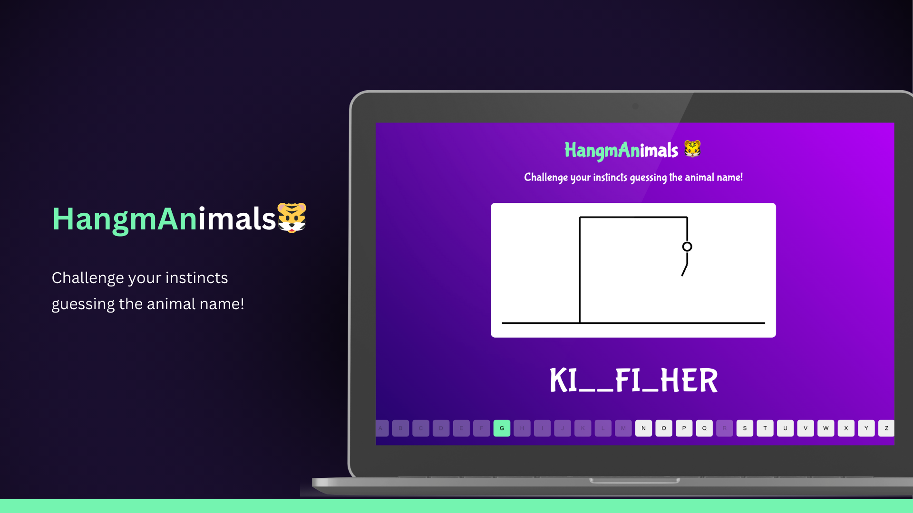

## The Game
Welcome to HangmAnimals, a classic word-guessing game brought to life with modern technology! Built with ReactJS and styled with CSS, the game provides an interactive and engaging experience for players of all ages. 

The objective is simple: guess the hidden animal name by selecting letters below. Each correct guess reveals a part of the word, but be careful - too many wrong guesses and it's game over! With a wide range of words to challenge your vocabulary, HangmAnimals is both entertaining and educational.

Are you ready to challenge your instints?

## Technologies
The technologies used were:
- HTML;
- CSS;
- Javascript;
- ReactJS
- Figma;

## Layout
You can see the project's layout at [link](https://www.figma.com/file/jiR3msf7va4gCvGn45p8zm/Biscoito-da-Sorte-(Community)?type=design&node-id=203-48&mode=design&t=jv7juRrrdPH9ufBV-0). 
A [Figma](https://www.figma.com) account is required.